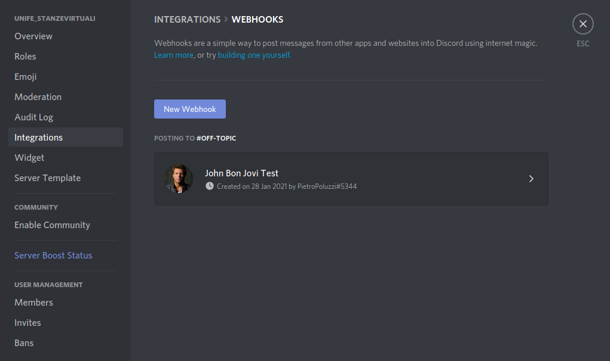
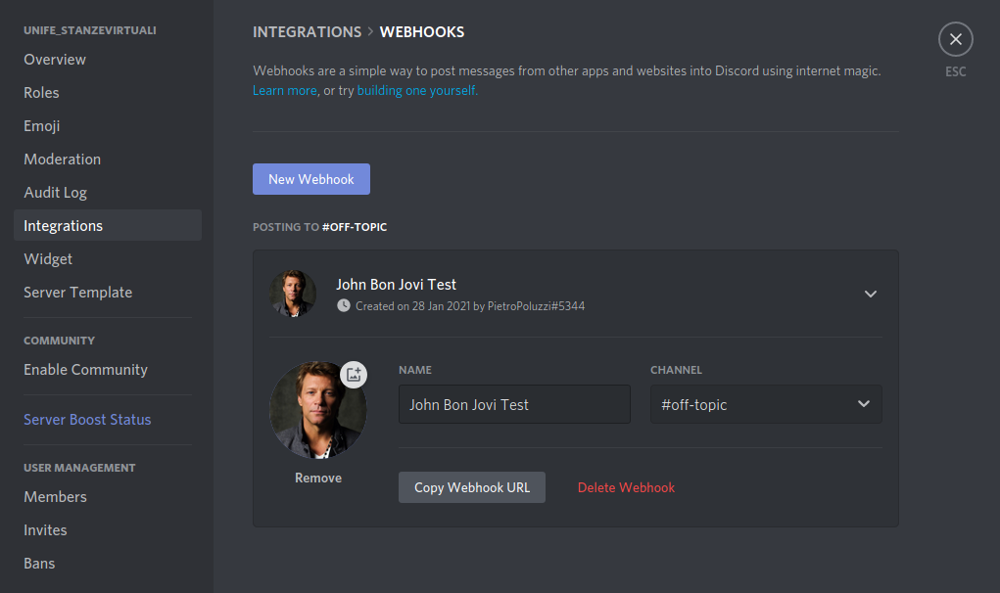

# Arduino MKR WiFi 1010

[Getting started](https://www.arduino.cc/en/Guide/MKRWiFi1010)

## Setting Up Arduino on Linux

Here are some problems I faced up during the develop of Arduino code on my Ubuntu Linux machine.

### Open the serial port

If you try to load a program that requires **Serial Port** and the IDE throws an error like the following:

```bash
processing.app.debug.RunnerException
# [...]
Caused by: processing.app.SerialException: Error touching serial port '/dev/ttyACM0'.
# [...]
Caused by: jssc.SerialPortException: Port name - /dev/ttyACM0; Method name - openPort(); Exception type - Permission denied.
```

You need to add the execution permission on the port:
```bash
sudo chmod 666 ttyACM0
```

You could also need to add yourself to the `dialout` group:
```bash
sudo usermod -a -G dialout $USER
```

Logout and then log back in for the group changes to take effect (or just `restart` the machine).

## Project Folders

To allow a better readability of the repository, below is shown all the code folder by folder.

### bot :robot:

#### Discord

##### discord_hello_world

It contains a simple Discord Bot. The header comment should be enough exhaustive, but let's add some images. 

Open your server and go to `Server Settings > Integrations > Webhooks`:




In my case, I called the bot as the famous musician  **John Bon Jovi**



Press on `Copy Webhook URL` and create the file `arduino_secrets.h` as follow:

```bash
// 1. Webhook URL without the starting 'https://discordapp.com'
#define SECRET_WEBHOOK "/api/webhooks/..." // replace all the content between the quotes

// 2. enable ("true") or disable ("false") text on speech
#define SECRET_TTS "true"

// 3. WiFi name of the network the Arduino MKR have to connect to surf the Internet
#define WIFI_SSID "" // inside the quotes

// 4. WiFi password of the network the Arduino MKR have to connect to surf the Internet
#define WIFI_PWD "" // inside the quotes

```


#### Telegram

##### UniversalTelegramBot

###### echo_bot

`cd bot/Telegram/UniversalTelegramBot/echo_bot/`

Telegram bot which replies to all the text message you send to him.

###### LED_on_off_bot

`cd bot/Telegram/UniversalTelegramBot/LED_on_off_bot`

Switch ON or OFF the built-in LED of the board.

###### reply_keyboard_markup

`cd bot/Telegram/UniversalTelegramBot/reply_keyboard_markup`

Use the Telegram's **keyboard markup** to communicate with the bot. 

###### send_logo_photo_from_URL

`cd bot/Telegram/UniversalTelegramBot/send_logo_photo_from_URL`

The bot uses an `HTTP` connection to send a logo from those list:

1. Arduino
2. Raspberry PI

### input

#### distance

###### basic_SR04

`cd input/distance/basic_SR04`

Test the SR04 sensor.

#### potentiometer

##### map_value

`cd input/potentiometer/map_value`

Map the value of the potentiometer. It is received as analog input from the board, by means its values are between `0` and `1023` (10 bits $ = 2^{10} = 1024$). An RGB LED needs values  between `0` and `255` (8 bits $= 2^8 = 256$). To allow a potentiometer to control a slice of an RGB LED, you need to map the potentiometer values using precisely the [map()](https://www.arduino.cc/reference/en/language/functions/math/map/) Arduino function as follow:

**1- Syntax**

```bash
map(value, fromLow, fromHigh, toLow, toHigh)
```

**2- Parameters**

`value`: the number to map.
 `fromLow`: the lower bound of the value’s current range.
 `fromHigh`: the upper bound of the value’s current range.
 `toLow`: the lower bound of the value’s target range.
 `toHigh`: the upper bound of the value’s target range.

**3- Returns**

The mapped value.

##### voltage_test

`cd input/potentiometer/voltage_test`

Evaluates the voltage (from `0V` to `5V`) that the board receive and interprets as a value from 0 to 1023.

#### temperature

##### basic_thermometer

`cd input/temperature/basic_thermometer`

A basic thermometer made using the TMP36 sensor.

### MKR_SD_PROTO_SHIELD  :bar_chart:

#### ASCII_logo_download

`cd MKR_SD_PROTO_SHIELD/ASCII_logo_download`

The board establish a connection to the Arduino server and downloads the ASCII logo.

#### card_info

`cd MKR_SD_PROTO_SHIELD/card_info`

Print on **Serial Monitor** the information about the **SD card** status. 

### output

#### buzzer

##### buzzer_on_off

`cd output/buzzer/buzzer_on_off`

Test the buzzer my making "blink" it.

##### play_melody

`cd output/buzzer/play_melody`

Play the melody you want by specifying the note (from the constants in `musical-notes.h`) and the length.
Assuming the base time of 4/4, and that `1000 ms = 1 sec = 60 BPM` (Beats per Minutes), the notes' length are:

- whole note -------> `1000 / 1 = 1000`
- half note --------> `1000 / 2 = 500`
- quarter note -----> `1000 / 4 = 250`
- eighth note ------> `1000 / 8 = 125`
- sixteenth note ---> `1000 / 16 = 62.5`
- thirty-two note --> `1000 / 32 = 32.25`

Notes with dot:
- dotted whole note ------> 3/2 <---> `(1000 / 1) + (1000 / 2) = 1000 / (2/3) = 1500`
- dotted half note -------> 4/3 <---> `(1000 / 2) + (1000 / 4) = 1000 / (4/3) = 750`
- dotted quarter note ----> 6/16 <---> `(1000 / 4) + (1000 / 8) = 1000 / (8/3) = 375`
- dotted eighth note -----> 6/32 <---> `(1000 / 8) + (1000 / 16) = 1000 / (16/3) = 187.5`
- dotted sixteenth note --> 3/32 <---> `(1000 / 16) + (1000 / 32) = 1000 / x = 93.75`

### serial-communication

#### ASCII_table

`cd serial-communication/ASCII_table`

The ASCII table was inspired by [Tutorial/ASCIITable](http://www.arduino.cc/en/Tutorial/ASCIITable) from the official website of Arduino.
The first visible ASCII element is the exclamation mark `!`, which is associated to the number 33

```c
// those declarations are equivalent
char character = 33;
char character = '!';
```

#### sizeof_test

`cd serial-communication/sizeof_test`

It simply tests the functionality of [sizeof](https://www.arduino.cc/reference/en/language/variables/utilities/sizeof/) Arduino function. 

## Libraries
### WiFiNINA
[WiFiNINA](https://www.arduino.cc/en/Reference/WiFiNINA) library allows Arduino MKR WiFi 1010 to be able to connect to a WiFi network. If you want to connect the board to a *wired network* using an Ethernet cable, you need to buy the [Arduino MKR ETH Shield](https://store.arduino.cc/arduino-mkr-eth-shield) from the official [Arduino Store](https://store.arduino.cc/).

To install **WiFiNINA** library, navigate to:
1. **Tools**
2. **Manage Libraries**
3. search for **WiFiNINA**
4. click on the **Install** button on the right bottom corner.

## Reference
- [Changing permissions on serial port](https://askubuntu.com/questions/58119/changing-permissions-on-serial-port)
- [emoji-cheat-sheet](https://github.com/ikatyang/emoji-cheat-sheet/blob/master/README.md)
